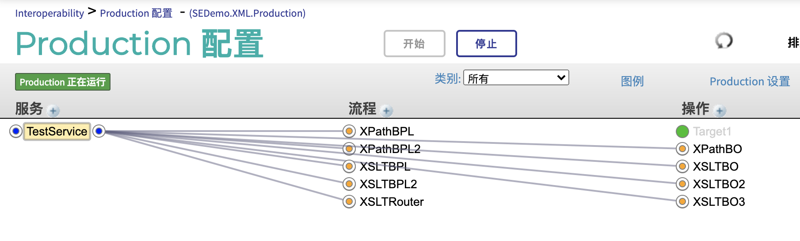
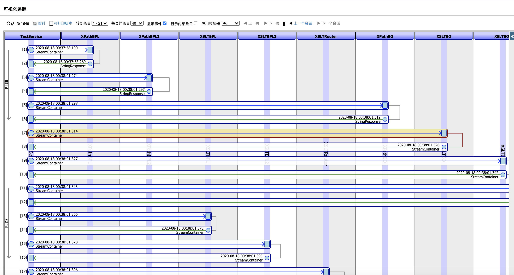

# 示例包SEDemo.XML

演示IRIS中对XML消息处理的基本技术，即在IRIS中使用xpath, xslt和IRIS虚拟文档vdoc.它们是iris处理
互联互通消息的基础。 

演示包包含一个production。业务服务TestService在启动后会向各个其他组件发送消息，那些组件演示了在BPL, BO，也就是在代码里如何使用xpath, xslt, 以及vdoc处理xml消息。 下面是production的结构：    

通过查看代码以及组件之间的消息，客户可以了解这些组件工作的细节。  
  

## 演示包的加载

两种方法加载演示包： 
1. 下载SEDemo_XML.xml,并在管理界面或者studio导入并编译。
2. 如果用户使用VSCode，可以克隆repository,连接自己的IRIS实例，将src/SEDemo整个包导入自己实例中的有interoperability的命名空间。	

3. 

4. 启动production, TestService服务会自动发送消息给各个组件，客户可以查看代码的执行以及组件之间的消息，学习在iris中使用xpath, xslt, 虚拟文档的工具和技术。

