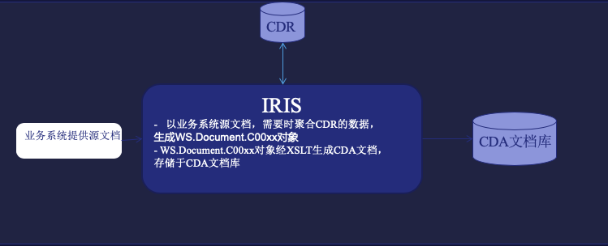
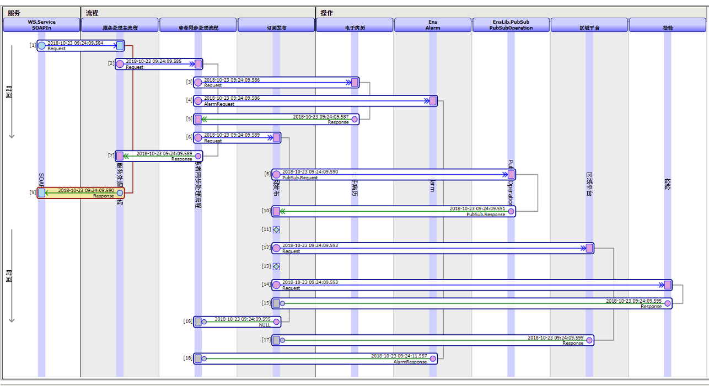

演示包包括在集成平台上部署互联互通数据元，数据集，并帮助生成互联互通文档的方案示例。包含了以下的内容：

# WS.Code

互联互通规范所用的代码表类和代码库。 这是一个非常初级的示意, 更多是作为为整个示例库的一个支持部分，而并不是完整术语代码表的管理。这些代码表包含了互联互通使用的CV Code和GBT Code，为了查询需要，在code和displayName上添加了索引。

# WS.DataElement和WS.DataSet

互联互通数据元类和数据集类。如果客户需要做数据元和数据集的前端管理，这个类可以有帮助。另外， 在下面的WS.Document包中，WS.Document使用了WS.DataElement做为属性字段。

加载: 导入WS.DataElement和WS.DataSet 

# WS.Document和转换CDA的xslt文件

这个包的目的是演示使用IRIS生成CDA文档。如果客户希望使用IRIS的能力生成CDA文档， 那么可以充分使用IRIS的数据汇聚作用，从另外的系统中补充源文档中缺少的信息。如下图， 当源文档缺少某个内容时，IRIS可以从CDR获得并聚合成一个对象，然后使用xslt转换为互联互通文档。

## WS.Document.Bundle
WS.Bundle以及其中的子集WS.Document.Set是一个中间的数据模型， 负责客户独特的数据结构到WS.Document.Cxxx的转换。
- 定义了文档的通用属性，比如模板编号，标题，版本号，创建时间，作者等， 对应了互联互通文档的相应部分。
- 包含了患者章节，住院章节，相关文档章节等等， 对应互联互通文档的相关章节
- WS.Document.Bundle使用了**WS.Document.Set**里面的类作为属性，这些类包括address, authenticator, loaction, patient,relatedDcoument等等CDA文档中通用的结构。

这样不是必须的， 但带来的好处是：WS.Bundle是一个通用的数据接口，bundle里包含患者， 文档， 作者，机构等等所有互联互通各种服务的架构， 通过它， 可以把所有文档到CDA的转换固定下来， 客户的任意数据结构， 任意xml，可以简单的转换到WS.Bundle，这部分工作属于现场实施，而WS.Bundle到CDA固定于产品中。 
## WS.Document.C00xx包
对应于53个互联互通文档，应该有53个C00xx包，每个包中的类对应一个互联互通文档。

## WS_Document_XSLT.zip
xslt文件包， 它们可以很方便的转变成CDA文档。 

# WS.Service包

- WS.Service.SoapIn\
这是个标准的IRIS SOAP业务服务，收到action和message两个入参，发送给其他业务组件。

- WS.Service.Request, WS.Service.Response
  服务接口和其他Production业务组件之间传递的消息示例。其中包括了字符串(Action,DocType)，流(Content)，和虚拟文档EnsLib.EDI.XML.Document的属性(EDIDoc)。客户自己的消息不一定包含所有这些属性. 这里使用了它们是为了使用字符串，流和虚拟文档中的处理HL7 V3消息或者CDA文档格式的能力。

    Property Content As %Stream.GlobalCharacter(XMLSTREAMMODE = "LINE");
    Property EDIDoc As EnsLib.EDI.XML.Document;
    Property DocType As %String;
    Property Action As %String;
    Property Source As %String(MAXLEN = 250, TRUNCATE = 1);

客户自己的消息格式可以按自己的需要修改，下面的几个系统类是可能的选择：

    Ens.StringContainer
    Ens.StreamContainer
    EnsLib.XSLT.TransformationRequest
    EnsLib.XSLT.TransformationResponse

# WS.Demo包
  提供一些互联互通中使用集成平台功能的例子，学习这些例子前确认已经有了基本xml处理的知识，这部分参考[IRIS XML处理实例包](SEDemoXML.md)
## WS.Demo.CDADemo

产生CDA文档,包括从不同系统聚合数据。 

临床数据库CDR： 在平台兼具CDR功能时， 此BO可以收到并提供互联互通服务。产品里用PatientAdd和PatientQuery来演示。 

PatientAdd()里面用WS.Service.Entity.Bundle作为中间的数据结构。PatientAdd中的数据用DTL添加入这个Bundle, 而Bundle和返回的互联互通响应V3消息之间用xslt实现。 
附件里提供了一些DTL的例子，包括病人添加，查询医疗机构，文档添加查询到Bundel的DT转换， 以及相应的xslt文件。
其中使用了SEDemo.CDRLite.Patient来储存患者， 患者id取自请求消息中的
<!--本地系统的患者ID -->
<id root="2.16.156.10011.0.2.2" extension="0s0sdsdsssddd5q7"/>

如果这个ID在数据区CDRLite.Patient已经存在， 响应消息为失败，并包含请求消息中患者的内容； 否则， 如果请求消息中的患者存储CDR成功， 返回成功。（sender, receiver等其他内容没有仔细处理， 可能不正确，请忽略）

## SEDemo.ServiceMatrix

来自一个客户的真实需求，实现一个互联互通服务的Matrix。具体的要求是这样：客户在没有集成平台的之前，HIS上有病人数据更新时，HIS会发多个PatientAdd给各个业务系统，比如EMR, LIS, RHIS…等等。在上线集成平台并做互联互通改造时，客户希望HIS只发送一个请求通知CDR，而由其他系统负责分发工作。IRIS所做的集成平台是做这个工作的最好选择，因此在演示中，我将业务流程设计为：HIS将请求将发送给CDR, 如果CDR返回的响应消息的结果是"AA"(成功), 那么请求会由集成平台分发给其他系统， 而这个其他系统的列表基于订阅发布实现，以更容易的管理。 消息流程如下：

###to be clean up

            因此， Demo中当上一步的PatientAdd()被CDRLite返回的是"注册成功"时， 同样的请求会分发其他系统， 如果不成功则不会。

            PatientQuery：使用请求消息中以下字段中的id查CDRLite, 如果查到返回标准成功响应消息， 否则响应消息中会出现”此病人不存在". 

            实现方式如果PatientAdd, 请参考PatientQuery.xsl。

                <livingSubjectId>
                    <value root="2.16.156.10011.0.2.2" extension="0ssddd5q7"></value>
                    <semanticsText>患者ID</semanticsText>
                </livingSubjectId>
        

## 演示包的加载

- 两种方法加载演示包的代码部分： 
    1. 下载WS.xml,并在管理界面或者studio导入并编译。
    2. 如果用户使用VSCode，可以克隆repository,连接自己的IRIS实例，将src/WS整个包导入自己实例中的有interoperability的命名空间。

- 加载WS.Code包里面所有Code类的内容

    为了方便用户使用，我已经生成了所有术语表的内容，用户可以从管理界面导入global文件**WSCodeGlobalExport.gof

- 加载HL7 v3 Schema

    demo里的很多消息使用了虚拟文档处理，这需要HL7 v3消息的schema。 获得这个schema的最好途径是从互联互通测试机构得到，这保证了schema和测试数据的符合无误。  
    如果无法得到卫健委测试的schema包， 可以尝试使用HL7提供的包，比如从以下地址：
    [HL7 Version 3 Normative Edition, 2017](https://www.hl7.org/implement/standards/product_brief.cfm?product_id=454)
    [CDA® Release 2](https://www.hl7.org/implement/standards/product_brief.cfm?product_id=7)

    测试中使用的schema包括：
        - CDA模板：POCD_MT000040
        - 患者添加：PRPA_IN201311UV02
        - 患者查询：PRPA_IN201305UV02
        - 文档添加：ProvideAndRegisterDocumentSetRequest
        - 文档查询：GetDocumentStroedInfoRequest

    获得schema包后可以通过用户门户上的 "Interoperability>交互操作>XML>XML Schema结构”导航到操作页面，导入需要的schema。

- 加载xslt文件

    可以下载WS_xslt_files.zip文件并解压，或者拷贝src/xslt_files里面的文件。
    将[xslt文件]拷贝到客户的电脑的IRIS安装路径下的CSP/XSLT。这个路径是某些代码里使用的硬路径， 因此如果客户使用其他路径， 相应的代码也要修改。 
